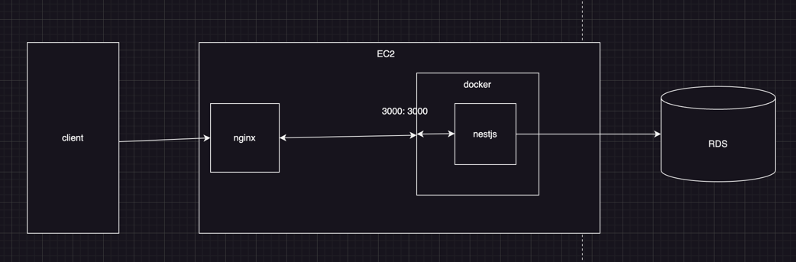
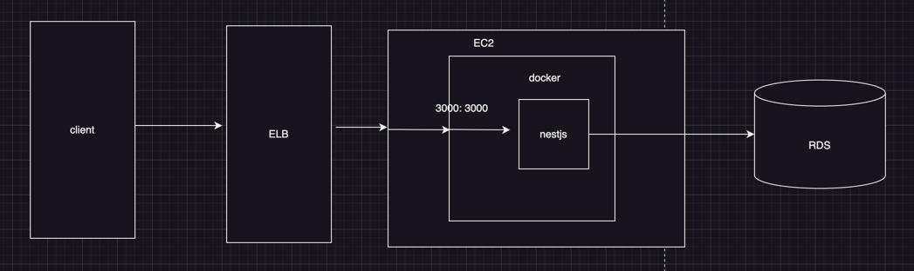

# README

## Description
- SoptOfficial 공홈 API 서버 입니다.
- Package Manager는  ```Yarn Package Manager``` 를 사용합니다.

## Overview
1. [Getting Started](#Getting-started)
2. [Official_Server Structure](#official_server_structure)
3. [Deploy_Pipeline](#deploy-pipeline)

# Getting-started
### 1.Local 서버 실행
```bash
 yarn start:local 
```
```yarn start:local``` 를 실행학게되면 다음과 같은 작업을 수행합니다.

1. envs/local.develop.env 파일을 읽어서 환경변수를 설정합니다.
2. docker-compose를 이용하여 local에 postgresql 데이터베이스 컨테이너를 실행합니다.
3. nestjs가 env파일을 읽어서 local Database에 연결하여 서버를 실행시킵니다.

### Develop Stage 서버 실행
```bash
 yarn start:develop 
```
- env에 명시된 데이터베이스에 연결되어 서버를 실행합니다.


> production stage 서버는 직접 실행시키는 script가 없고, ```config:prod``` 명령어로 env파일을 읽어서 실행합니다.
> env 과같은 환경 변수는 담당자에게 공유 받으세요.

# project-structure

아키텍처는 다음과 같이 형성되어있습니다.
## dev arichitecture


## prod arichitecture


- 인스턴스는 EC2 내부에서 동작합니다.
- EC2 내부에 Docker container가 존재하고, 호스트, 컨테이너 포트는 3000:3000으로 포워딩 되어있습니다.
- docker image는 개인 dockerHub에서 관리하고 있고 인수인계시 계정을 전환하는 작업이 필요합니다.

둘다 비슷한 구조를 형성하고있지만 Nginx, ElB 존재 여부의 차이밖에 없습니다.

## deploy-pipeline
- deploy pipeline은 github action을 이용하여 구성되어있습니다.
- github action은 ```./github/workflows``` 에서 확인할 수 있습니다.
- workflow 파일은 총 3가지가 있고, 각각 다음과 같은 역할을 합니다.
  1. ```ci.deploy.yml``` : develop 브랜치에 PR이 생성될때마다 실행됩니다. 테스트를 수행합니다.
  2. ```cd.develop.yml``` : develop 브랜치에 푸시(또는 머지)가 되었을때마다 수행합니다. develop 서버에 배포가 됩니다.
  3.  ```cd.prod.yml``` : main 브랜치에 푸시(또는 머지)가 되었을때마다 수행합니다. production 서버에 배포가 됩니다.
- ```cd.***.yml``` workflow는 다음과 같은 동작을 합니다.
  1. docker image를 빌드합니다.
  2. docker image를 dockerHub에 push합니다.
  3. EC2에 ssh로 접속하여 dockerHub에서 이미지를 pull합니다.
  4. EC2에서 실행중인 container를 종료합니다.
  5. docker container를 실행합니다.
> DockerHub 관련 Secret은, gitHub 관리자에게 문의하여 Owner권한을 획득 후, Repository secret에서 설정하시기 바랍니다. 자세한 설명은 별도로 공유드린 문서에서 확인 하실 수 있습니다.


